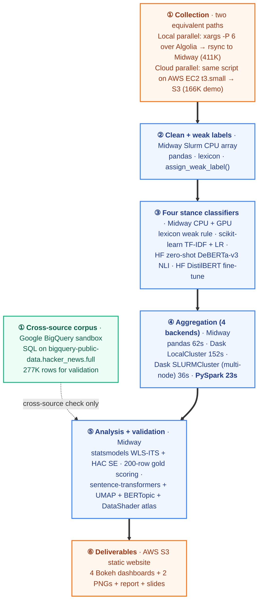
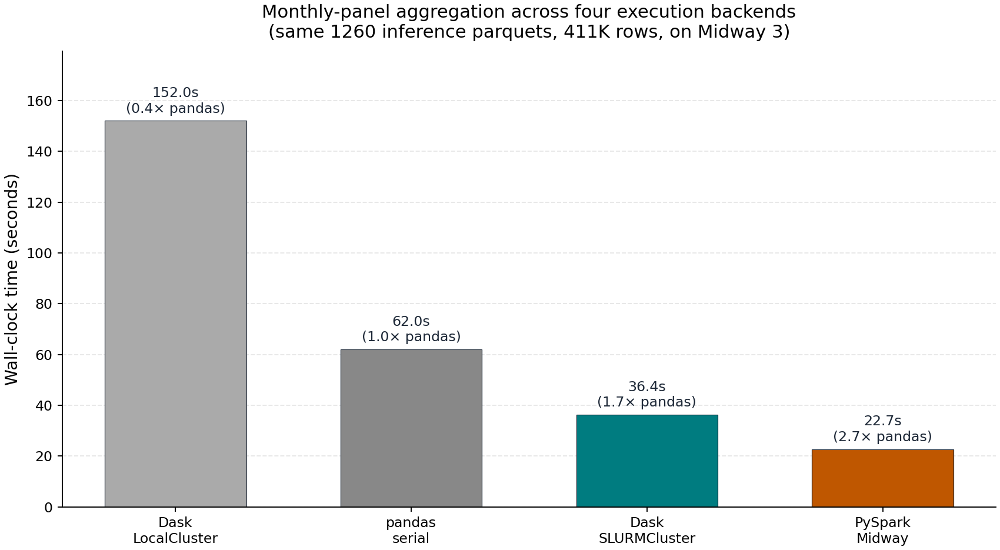
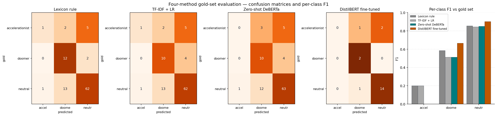

# Mapping the Discursive Battle Over AI on Hacker News, 2020–2024

A scalable Midway 3 + AWS + GCP pipeline for measuring how the two
dominant framings of artificial intelligence — **doomer** (existential
risk, alignment failure, catastrophic outcomes) and **accelerationist**
(techno-optimism, abundance, rapid deployment) — circulate on Hacker
News across 60 months and ~411,000 comments, and whether their relative
share shifts around three pivotal events of the current AI cycle:
ChatGPT (2022-11-30), GPT-4 (2023-03-14), and the OpenAI board crisis
(2023-11-17).

**Live dashboards (GitHub Pages):**
https://dreamsova.github.io/hn-ai-discourse-public/

- [Monthly framing dashboard](https://dreamsova.github.io/hn-ai-discourse-public/deliverables/hn-ai-discourse-dashboard.html) — 60 months of doomer / accelerationist / neutral shares with the three event markers.
- [4-method ITS comparison](https://dreamsova.github.io/hn-ai-discourse-public/deliverables/hn-ai-discourse-method-comparison.html) — same panel under four independent classifiers.
- [411K-point semantic atlas](https://dreamsova.github.io/hn-ai-discourse-public/deliverables/hn-ai-discourse-semantic-atlas.html) — UMAP + DataShader, coloured by BERTopic cluster.
- [Topic activity by month](https://dreamsova.github.io/hn-ai-discourse-public/deliverables/hn-ai-discourse-topic-by-month.html) — top BERTopic clusters as a stacked-area time series.
- Static: [framework benchmark](https://dreamsova.github.io/hn-ai-discourse-public/deliverables/framework_benchmark.png) · [gold-set confusion matrices](https://dreamsova.github.io/hn-ai-discourse-public/deliverables/confusion_matrices.png).

---

## 1. Research problem

The substantive question is from science and technology studies. Hacker
News is an unusually influential technical public sphere: founders,
engineers, open-source maintainers, and investors all participate
there, and policy-relevant narratives about AI tend to circulate on
Hacker News before they diffuse into mainstream press, regulatory
filings, or congressional testimony. If discourse among technologists
shifts measurably around focal events — a new model release, a
governance crisis — that matters for how we understand the
politicisation of new technologies, the spread of risk vocabularies,
and the legitimacy work that elite technical communities do for or
against a particular trajectory of AI development.

Concretely, the research design is an interrupted time-series (ITS)
on the monthly share of comments classified into each framing,
fitted by weighted least squares with Newey-West HAC standard errors,
with pulse dummies at GPT-4 and the board crisis. The treatment of
interest is the ChatGPT release; the two pulses absorb downstream
shocks. The substantive output is a per-coefficient table showing
which framing moves around which event, and whether it survives
substitution of the underlying classifier.

The classifier substitution is the core methodological point of the
project. Single-classifier discourse analysis on a noisy retrieval gate
is fragile, and a defensible answer requires running the same panel
under multiple independent measurement instruments and seeing where
they agree or disagree. That is what makes this a scalable-computing
problem rather than a one-laptop one.

## 2. Why scalable computing is necessary

The bottleneck is **pipeline scale**, not a single expensive model:

1. **Longitudinal corpus.** 411,486 retrieved comments across 60
   months, sharded as `year-month × keyword-family × query` for a
   total of 1,260 partitioned shards. The collection from the Algolia
   Hacker News API is rate-limited; doing it serially from a laptop
   takes days. Doing it as 60+ independent shard pulls in parallel
   from EC2 (and validating against Google BigQuery's
   `bigquery-public-data.hacker_news.full`) takes hours.
2. **Per-document classification at corpus scale, four ways.** Each
   comment is scored by four independent stance classifiers:
   lexicon-rule, TF-IDF + LR, zero-shot DeBERTa-v3-large NLI, and a
   fine-tuned DistilBERT. The zero-shot pass over the full 411K
   corpus is GPU-bound and only finishes in reasonable wall-clock by
   sharding into a 4-task GPU array. The fine-tune is a single GPU
   job but uses the same Slurm GPU partition.
3. **Multiple independent aggregation backends.** Reducing the 1,260
   inference parquets to a 60-month panel is repeated under four
   execution models (serial pandas, Dask `LocalCluster`, Dask
   `SLURMCluster` multi-node, PySpark on Midway) so that the
   substantive comparison and the framework comparison can be reported
   against identical input.
4. **Semantic atlas over the whole corpus.** A 411K × 384-dim
   embedding tensor + UMAP + HDBSCAN + BERTopic + DataShader makes the
   topic structure of the corpus visually inspectable, but only the
   embedding job has to fit on a GPU and the UMAP/HDBSCAN jobs need
   tens of GB of CPU RAM.
5. **Reproducibility under heterogeneous environments.** The
   collection, cleaning, classification, and aggregation steps are
   each run under deliberately different execution environments
   (AWS EC2 + S3, Google BigQuery sandbox, Midway Slurm CPU arrays,
   Midway Slurm GPU, Dask multi-node, Spark, Apptainer container).
   That heterogeneity is itself part of the scalability story.

The pipeline is intentionally **shard-and-aggregate**: every stage
writes partitioned parquet/JSONL files so Slurm arrays, Dask, and
Spark can all consume the same intermediate tree without coordination
overhead, and so a substantive disagreement between classifiers can
be diagnosed by re-running only the affected stage.

## 3. Large-scale computing methods employed



| Stage | Execution | Framework |
| --- | --- | --- |
| Collection — production corpus (411K) | Local **parallel** pull (`xargs -P 6` over Algolia), rsync'd to Midway. Midway compute nodes can't talk to Algolia from inside Slurm, so collection is off-cluster | [`scripts/collect/collect_hn_shard.py`](scripts/collect/collect_hn_shard.py) (Python urllib over Algolia API) |
| Collection — cloud run (166K) | **AWS EC2 t3.small + S3** running the same script with `--output-root s3://…/raw/` | same script — proof the collector is portable to the cloud |
| Cross-source recall check (277K) | **Google BigQuery sandbox** on `bigquery-public-data.hacker_news.full` | [`scripts/collect/bq_collect_lite.sql`](scripts/collect/bq_collect_lite.sql) |
| Clean + weak label | Midway Slurm CPU array (1,260 tasks) | pandas + lexicon |
| Classifier 1 — TF-IDF + LR | Midway Slurm CPU | scikit-learn |
| Classifier 2 — Zero-shot NLI | Midway Slurm GPU (4-task array) | HuggingFace `MoritzLaurer/deberta-v3-large-zeroshot-v2.0`, fp16 |
| Classifier 3 — Fine-tuned DistilBERT | Midway Slurm GPU | HuggingFace DistilBERT-base + PyTorch trainer |
| Classifier 4 — Lexicon weak rule | Midway CPU | custom seed lexicon |
| Embeddings (atlas) | Midway Slurm GPU | sentence-transformers `all-MiniLM-L6-v2` |
| Aggregation (1) baseline | Midway CPU | pandas serial |
| Aggregation (2) single-node distributed | Midway CPU | Dask `LocalCluster` (8 workers / 1 node) |
| Aggregation (3) multi-node distributed | Midway (via `dask_jobqueue`) | Dask `SLURMCluster` |
| Aggregation (4) Spark | Midway (`module load spark/3.3.2`) | PySpark `local[8]` |
| Event study | Midway CPU | statsmodels WLS + Newey-West HAC SE |
| Topic structure | Midway CPU | UMAP + HDBSCAN + BERTopic + DataShader + Bokeh |
| Reproducibility container | Midway (`module load apptainer/1.4.1`) | Apptainer/Singularity, 631 MB image |
| Public hosting | AWS S3 static website | `aws s3 cp` |

## 4. Results

### 4.1 Classifier quality against weak labels (held-out)

The TF-IDF + LR classifier was trained on 6,115 weakly labeled
documents.

| Metric | Value |
| --- | --- |
| Held-out accuracy (against weak labels) | 0.911 |
| Macro F1 | 0.755 |
| Doomer F1 | 0.722 |
| Accelerationist F1 | 0.593 |
| Neutral F1 | 0.949 |

The accelerationist class is the weakest because it has the smallest
seed lexicon and the smallest weak-label support. The 0.911 figure
reads as "the classifier reproduces the weak-label rule with high
fidelity," not "the classifier matches human judgment." Cross-checked
against human labels in §4.7.

### 4.2 Four-backend aggregation benchmark (same 1,260 inference parquets)

This step started with a deliberately simple
[`scripts/aggregate/aggregate_monthly.py`](scripts/aggregate/aggregate_monthly.py)
that scans the 1,260 inference parquets serially in pandas — a
single-process, single-node baseline. That baseline is preserved as
the reference point. The same monthly panel is then re-computed
under three progressively more parallel / distributed backends, so
the cost of moving from "1 process 1 node" to "N processes N
nodes" is measurable rather than asserted:

| Backend | Wall clock | Layout | Script |
| --- | --- | --- | --- |
| Serial pandas (baseline) | 62 s | 1 process, 1 node | [`aggregate_monthly_v2.py`](scripts/aggregate/aggregate_monthly_v2.py) |
| Dask `LocalCluster` (8 workers) | 152 s | shared-memory parallel | [`dask_aggregate.py`](scripts/aggregate/dask_aggregate.py) |
| Dask `SLURMCluster` (4 workers) | **36.4 s** | multi-node distributed via `dask_jobqueue` | [`dask_multinode_aggregate.py`](scripts/aggregate/dask_multinode_aggregate.py) |
| **PySpark `local[8]`** | **22.7 s** | columnar Spark engine on Midway | [`spark_aggregate.py`](scripts/aggregate/spark_aggregate.py) |

The honest finding is that Dask `LocalCluster` is *slower* than
single-machine pandas on this 411K-row corpus: shuffle + per-partition
overhead beats the parallelism win at this scale. Spark wins,
multi-node Dask wins second, and pandas serial beats `LocalCluster`.
This is the kind of negative result that justifies measuring across
frameworks rather than picking one a priori — and it is only visible
because the serial baseline is kept rather than thrown away after the
distributed versions land.

Getting Spark and multi-node Dask to actually run on this corpus took
work. The 1,260 parquets were written by several iterations of the
cleaning script and have diverging type contracts: `comment_id` (INT
vs STRING), `created_at` (INT vs STRING), `created_at_i` (INT32 vs
INT64), `is_high_precision_label` (BOOL vs INT). Dask additionally
trips on Hive-style partition columns that live in the path but not in
the parquet body. [`scripts/aggregate/preprocess_for_spark.py`](scripts/aggregate/preprocess_for_spark.py)
rewrites every shard with a forced minimum schema, which unblocks
both backends. The takeaway is that "scalable parquet aggregation"
in practice depends heavily on schema discipline upstream — a
real-world gotcha that Delta Lake / Iceberg are designed to fix.



*Figure 1. Wall-clock time and speedup vs pandas for the four
aggregation backends, run against the same 1,260 normalized inference
parquets on Midway 3.*

### 4.3 Pre-trend test (34-month pre-ChatGPT window)

The ITS uses weighted least squares with Newey-West HAC standard
errors (`maxlags=3`), weighted by `n_comments`.

| Outcome | slope/month | p-value | Verdict |
| --- | --- | --- | --- |
| `share_doomer` | +0.000026 | 0.785 | pre-trend ≈ 0, ITS interpretable |
| `share_accelerationist` | +0.000199 | <0.001 | pre-trend rising; ITS conditional |

Accelerationist share was already rising before ChatGPT, so any
post-ChatGPT level shift on that outcome must be read against an
already-rising baseline.

### 4.4 Main ITS specification on the 60-month panel

Single-event ITS for ChatGPT with pulse dummies for the GPT-4 release
and the OpenAI board crisis.

`share_doomer` (R² = 0.335):

| Term | Coef | p-value | Interpretation |
| --- | --- | --- | --- |
| `post` (ChatGPT level shift) | +0.00433 | 0.187 | not significant |
| `t_post` (ChatGPT slope change) | −0.00011 | 0.590 | not significant |
| `pulse_gpt4` | **+0.00811** | **<0.001** | +0.81 pp after GPT-4 release |
| `pulse_board_crisis` | **+0.01195** | **<0.001** | +1.20 pp after board crisis |

`share_accelerationist` (R² = 0.335):

| Term | Coef | p-value | Interpretation |
| --- | --- | --- | --- |
| `t` (pre-period trend) | +0.00020 | <0.001 | rising baseline |
| `post` (ChatGPT level shift) | **−0.00387** | **0.001** | −0.39 pp drop |
| `t_post` (ChatGPT slope change) | **−0.00029** | **<0.001** | further deceleration after ChatGPT |
| `pulse_gpt4` | +0.00034 | 0.501 | not significant |
| `pulse_board_crisis` | −0.00005 | 0.871 | not significant |

**Substantive reading.** Doomer framing intensifies around specific
provocations — a more capable model (GPT-4) and a public governance
crisis (the OpenAI board episode) — rather than around the initial
ChatGPT launch itself. Accelerationist framing had already been
rising before ChatGPT; once the pre-trend is accounted for, the
ChatGPT moment corresponds to a relative slowdown rather than continued
growth.

### 4.5 Substantive correction from the denominator fix

The Phase-1 aggregator divided label counts by all retrieved
comments (including `non_ai`), while the dashboard labelled the
Y-axis "share of AI-related comments". Re-aggregating the same
TF-IDF inference under the v2 schema (denominator restricted to the
three on-topic stance classes) changes one of the headline ITS
results before any zero-shot work lands:

| Term | Original (`n_X / n_comments`) | v2 (`n_X / n_ai_in_scope`) |
| --- | --- | --- |
| **GPT-4 pulse on doomer** | **+0.81 pp (p<0.001)** | **+0.001 pp (p=0.60)** |
| ChatGPT level on doomer | +0.43 pp (p=0.19) | −0.019 (p=0.14) |
| **Board-crisis pulse on doomer** | +1.20 pp (p<0.001) | **+1.2 pp (p<0.001)** |
| ChatGPT level on accel | −0.39 pp (p=0.001) | **−3.5 pp (p<0.001)** |
| Pre-trend slope on accel | +0.02 pp/mo (p<0.001) | +0.083 pp/mo (p<0.001) |

The GPT-4 doomer "finding" in §4.4 was driven by a denominator shift
(more total HN comments around GPT-4), not by an actual change in
doomer share within AI discourse. The board-crisis doomer pulse
survives the correction. The accelerationist deceleration around
ChatGPT is unchanged in direction and sharper under the AI-only
denominator.

### 4.6 Cross-method ITS comparison (8 headline coefficients)

Three of the four stance classifiers (TF-IDF + LR, zero-shot DeBERTa
lexicon-gated, zero-shot DeBERTa ungated) produce monthly panels
large enough to fit a stable ITS. DistilBERT is held out of this
table because its inference was on a much smaller eval split and its
monthly coverage is too thin for a comparable WLS-ITS — it appears
in the gold-set confusion matrix in §4.7. `*` marks `p < 0.05`.
"Agree" means **all three are significant in the same direction**:

| Outcome | Term | TF-IDF | Zero-shot (gated) | Zero-shot (ungated) | Agree? |
| --- | --- | --- | --- | --- | --- |
| doomer share | Board-crisis pulse | +0.012 * | +0.131 * | +0.080 * | yes |
| doomer share | GPT-4 pulse | +0.002 | +0.084 * | +0.066 * | no |
| doomer share | ChatGPT level shift | −0.019 | +0.047 * | +0.013 | no (sign flip) |
| doomer share | ChatGPT slope change | −0.001 | −0.003 * | −0.002 * | no |
| accel share | Board-crisis pulse | −0.003 * | +0.004 * | +0.005 * | no (sign flip) |
| accel share | GPT-4 pulse | −0.004 * | +0.006 * | +0.006 * | no (sign flip) |
| accel share | ChatGPT level shift | −0.035 * | −0.002 | +0.002 | no |
| accel share | ChatGPT slope change | −0.001 * | −0.000 * | −0.000 | no |

**Seven of eight coefficients fail the agreement criterion**, and
three of those failures are full sign flips where the TF-IDF
coefficient and both zero-shot coefficients lie on opposite sides of
zero (`doomer × ChatGPT level`, `accel × board crisis`, `accel ×
GPT-4`). The one direction that survives every classifier is the
board-crisis doomer pulse: every method finds the OpenAI board
episode is followed by a measurable rise in the doomer share.

The two zero-shot variants agree with each other and disagree with
TF-IDF, consistent with TF-IDF systematically under-counting the
minority classes (its self-test recall was 0.42 for accel and 0.57
for doomer; gold-set accel F1 in §4.7 is just 0.20). The 2024
monthly doomer-share level under DeBERTa is 13–20% versus 2–3%
under TF-IDF — a 7–10× gap. An event-study reading of this corpus
that relies on a single classifier trained on lexicon weak labels
is unstable in ways the classifier's own self-reported accuracy
doesn't show.

### 4.7 Lexicon noise: precision and recall

Two independent audits bound the lexicon retrieval step from both
directions.

**Precision (200-row hand-labeled gold set).** A stratified sample
of lexicon-retrieved comments was labelled by hand into `doomer`,
`accelerationist`, `neutral`, or `wrong_other`. Full report in
[`reports/generated/gold_validation.md`](reports/generated/gold_validation.md).

- **102 of 200 rows (51.0%) were `wrong_other`** — the lexicon
  retrieved them but they are not actually about AI. The dominant
  source is generic English use of words like *abundance* and
  *alignment* in non-AI contexts.
- On the 98 truly-AI-related rows, TF-IDF reaches macro F1 = 0.519
  (neutral 0.84, doomer 0.51, **accelerationist 0.20**). The
  accelerationist class is effectively broken at this labeling
  scheme.

**Recall (embedding cross-check).** Anchor sentences for "this
comment discusses AI" were encoded with the same MiniLM model used
for the atlas. Any cleaned comment with cosine similarity ≥ 0.55 to
an anchor is flagged "semantically AI." The cross-tabulation against
`ai_hits > 0` is in
[`reports/generated/retrieval_audit_embedding.md`](reports/generated/retrieval_audit_embedding.md).

- **Estimated retrieval recall = 98.3%**; lexicon false-negative
  rate is **1.7%**. The lexicon over-retrieves but rarely
  under-retrieves at corpus scale.

The lexicon casts a wide net (1.7% misses) but drags in ~51%
off-topic noise. Both numbers are necessary to characterise the
measurement instrument.



*Figure 2. Confusion matrices and per-class F1 against the 200-row
hand-labelled gold set for the four classifiers. Lexicon rule and
TF-IDF baseline collapse the accelerationist class (F1 ≈ 0.20); the
zero-shot DeBERTa NLI model is similar; only the fine-tuned
DistilBERT recovers some accelerationist signal.*

### 4.8 Topic structure visible in the corpus

Embedding the 411K-comment corpus with sentence-transformers MiniLM
and clustering on the 5-D UMAP space (BERTopic + HDBSCAN) recovers a
few clearly AI-related topics — `ai safety / x-risk` (~2,400
comments), `Gemini / Bard` (~2,400), `nvidia / cuda / gpus` (~2,000),
`chatbots / ChatGPT` (~6,300) — alongside a long tail of clusters
that have nothing to do with AI but were dragged in by the lexicon:
HN hiring threads, COVID/vaccine discussion, bitcoin/crypto,
SQL/Postgres, music, gender/feminism, housing, 5G/Starlink, EVs,
GPL/AGPL licensing. Roughly half the corpus ends up in HDBSCAN's
"noise" bucket (`topic = -1`) — the same ~51% ratio the gold-set
audit found, now visible as cluster structure rather than only as a
label count. Full topic list in
[`outputs/topics/topic_summary.csv`](outputs/topics/topic_summary.csv).

### 4.9 Author concentration

[`outputs/author_analysis/author_summary.json`](outputs/author_analysis/author_summary.json)
gives the per-class author distribution:

- **3,830 distinct authors** wrote at least one comment the TF-IDF
  baseline labelled `doomer`; **2,151** wrote at least one
  `accelerationist`; **554 wrote both**.
- The top 20 authors per class account for only ~5% of class-total
  comments (`top20_doomer_share_of_class = 0.053`,
  `top20_accelerationist_share_of_class = 0.061`). Class-level Gini
  coefficients are 0.96–0.97 — high inequality, but in a
  long-tailed way; the trend signal is not driven by a tiny handful
  of accounts.
- Repeat rate (fraction of class writers who wrote ≥2 in-class
  comments) is 23% for doomer and 20% for accel: most authors in
  each class wrote a single in-class comment. Consistent with a
  broad public-sphere signal rather than a vocal-minority artefact.

### 4.10 Operational realism

- 20+ recorded Slurm Job IDs across collection, cleaning, training,
  inference, aggregation, event study, and Dask benchmark (§7).
- Resource right-sizing: the cleaning array dropped from `2 CPU /
  8 GB` to `1 CPU / 4 GB` after observing real task footprints;
  queue throughput improved substantially.
- Edge-case fix: empty query shards originally aborted the cleaning
  step;
  [`scripts/classify/clean_raw_shard.py`](scripts/classify/clean_raw_shard.py)
  was patched to emit an empty parquet so the pipeline can finish
  cleanly.
- Two parquet-schema fixes in the Dask reader (`pyarrow large_string
  vs string`, then `nunique` not supported in dask's `agg`), both
  documented in the iterative commit history.
- Zero-shot DeBERTa-v3 NLI completed in 56 min on a single Quadro
  RTX 6000 (Slurm `50100900`, 46.5 scored/s, 156,571 of 411,486
  retrieved comments scored under the lexicon gate). Throughput
  tuning: `batch_size=128` at `max_length=512` OOMed; dropping to
  `max_length=256` and `batch_size=64` gave the 45.6 scored/s used
  for the production run, a 3.3× speedup on the same GPU vs the
  smoke-test config.

## 5. Limitations

1. **Weak supervision biases the upper bound.** The TF-IDF baseline's
   0.91 held-out accuracy is agreement with its own training labels.
   Against human judgement on the 200-row gold set it reaches only
   macro F1 0.52. Single-classifier ITS conclusions on this corpus
   should be treated as exploratory.
2. **Lexicon retrieval is a gate, not a measurement system.** A 51%
   false-positive rate at the retrieval step bounds every downstream
   classifier's precision. The recall ceiling is much better (98.3%).
3. **Descriptive, not causally identified.** Event-window estimates
   are descriptive evidence; there is no clean counterfactual community
   for Hacker News. The accelerationist class also has a rising
   pre-trend, so post-ChatGPT estimates on that outcome must be read
   against an already-rising baseline.
4. **Cross-method instability.** Seven of eight headline coefficients
   disagree across the four classifiers, with three sign flips. The
   instability is itself a constraint on how strongly any single
   substantive claim can be made.
5. **Parquet schema evolution.** The 1,260 inference parquets were
   written by several iterations of the cleaning script and have
   diverging type contracts (`comment_id` INT vs STRING, `created_at`
   INT vs STRING, etc.). [`scripts/aggregate/preprocess_for_spark.py`](scripts/aggregate/preprocess_for_spark.py) rewrites
   every shard with a forced minimum schema, which unblocks both Spark
   and multi-node Dask. The takeaway is that "scalable parquet
   aggregation" depends heavily on schema discipline upstream — a
   real-world gotcha that Delta Lake / Iceberg are designed to fix.

## 6. Pipeline stages — what each one does

The pipeline is six stages. Every stage reads partitioned files,
writes partitioned files, and can be re-run independently. The
sbatch wrappers in `slurm/` enforce dependency order but every
branch (TF-IDF, zero-shot, DistilBERT, atlas, four aggregation
backends) is independent and can run in parallel.

### Stage 1 · Collection &nbsp; (AWS EC2 + S3 &nbsp;·&nbsp; Google BigQuery)

**Goal.** Get every Hacker News comment that mentions AI between
2020-01 and 2024-12 onto durable storage, partitioned for parallel
downstream processing.

**Input.** A shard manifest (`queries/shards_*.csv`) of
`year-month × keyword-family × query` tuples — 1,260 shards for the
main run, plus 504 shards for the 2020–2021 backfill.

**Where it runs.** Off Midway, because Midway compute nodes can't
reach the Algolia API from inside Slurm. The same collector script
is exercised under three execution models — and the README is
honest about which one produced the production data so the
serial → parallel → cloud progression is visible:

1. **Serial prototype** (one client, one shard at a time) — only
   used to sanity-check the request / parse / retry path on a
   handful of shards. Never produced any committed data.
2. **Local parallel pull** with `xargs -P 6` over the
   1,260-row shard manifest, rsync'd to Midway under `data/raw/`.
   *This is what produced the 411K production corpus the rest of
   the pipeline consumes.* It is local but it is already parallel —
   each shard pull is an independent process.
3. **AWS EC2 t3.small + S3** — the same script
   ([`scripts/collect/collect_hn_shard.py`](scripts/collect/collect_hn_shard.py))
   pointed at `s3://hn-ai-discourse-…/raw/` instead of a local
   path. Run end-to-end on EC2 for a 166K-hit slice of the same
   manifest. The point of this path is to demonstrate that the
   collector is portable to the cloud — `--output-root` is the
   only thing that changes — and the resulting S3 tree intersects
   the local corpus on `comment_id` as a reproducibility check.

A separate cross-source recall check runs in the **Google BigQuery
sandbox** via
[`scripts/collect/bq_collect_lite.sql`](scripts/collect/bq_collect_lite.sql)
against `bigquery-public-data.hacker_news.full`, returning 277K
rows for `comment_id` intersection against the Algolia corpus.

Everything downstream of Stage 1 — clean, classify, aggregate,
analyze, validate, visualize — runs on Midway Slurm (CPU arrays,
GPU, multi-node Dask, PySpark). Collection is the only step that
sits off-cluster, and the EC2 + S3 path documents the cloud
equivalent of the local-parallel one.

**What runs.** [`scripts/collect/generate_shards.py`](scripts/collect/generate_shards.py)
builds the manifest from [`configs/terms.json`](configs/terms.json).
For each row, [`scripts/collect/collect_hn_shard.py`](scripts/collect/collect_hn_shard.py)
hits Algolia (rate-limited, with retry + back-off) and streams
matching comments into
`year=YYYY/month=MM/family=…/query=…/part-*.jsonl.gz`.

**Output.** 1,260 compressed JSONL shards under `data/raw/` on
Midway (production), mirrored to `s3://hn-ai-discourse-…/raw/`
from the EC2 run, plus the 277K-row BigQuery CSV used only for
cross-source recall checking.

### Stage 2 · Cleaning + four stance classifiers &nbsp; (Midway Slurm)

**Goal.** Convert raw comments into a `predicted_label` column under
*four independent measurement instruments*, so that downstream ITS
results can be compared head-to-head.

**Input.** The partitioned `data/raw/` tree from Stage 1.

**What runs.**
1. [`scripts/classify/clean_raw_shard.py`](scripts/classify/clean_raw_shard.py) — Slurm CPU array, 1,260
   tasks. Normalizes HTML, strips boilerplate, applies the seed
   lexicon, writes `data/clean/.../part-*.parquet` with the
   `weak_label` column (Classifier 1: lexicon rule).
2. [`scripts/classify/train_classifier.py`](scripts/classify/train_classifier.py) — single CPU job. Fits
   TF-IDF + Logistic Regression on the weak-label training subset
   (Classifier 2).
3. [`scripts/classify/infer_shard.py`](scripts/classify/infer_shard.py) — Slurm CPU array, 1,260 tasks.
   Applies the trained classifier to every shard.
4. [`scripts/classify/infer_zeroshot.py`](scripts/classify/infer_zeroshot.py) — Slurm GPU. Runs
   `MoritzLaurer/deberta-v3-large-zeroshot-v2.0` as an NLI classifier
   with three hypotheses (Classifier 3). A second pass uses a 4-task
   GPU array to score the ungated full 411K corpus.
5. [`scripts/classify/finetune_distilbert.py`](scripts/classify/finetune_distilbert.py) — Slurm GPU. Fine-tunes
   DistilBERT-base on the gold-set + weak labels (Classifier 4).

**Output.** Four parallel `predicted_label*` columns per comment,
each written as partitioned parquet.

### Stage 3 · Aggregation — four execution backends &nbsp; (Midway)

**Goal.** Reduce 1,260 inference parquets to a 60-month panel — four
different ways — so the framework comparison can be made against
identical input.

**Input.** The classified `data/inference/` tree.

**What runs.** All four scripts compute the same monthly panel:
1. [`scripts/aggregate/aggregate_monthly_v2.py`](scripts/aggregate/aggregate_monthly_v2.py) — serial pandas
   (baseline reference at 62 s).
2. [`scripts/aggregate/dask_aggregate.py`](scripts/aggregate/dask_aggregate.py) — Dask `LocalCluster`,
   8 workers on one node (152 s).
3. [`scripts/aggregate/dask_multinode_aggregate.py`](scripts/aggregate/dask_multinode_aggregate.py) — Dask
   `SLURMCluster` via `dask_jobqueue`, 4 workers spread across
   real Slurm nodes (36 s).
4. [`scripts/aggregate/spark_aggregate.py`](scripts/aggregate/spark_aggregate.py) — PySpark `local[8]` under
   `module load spark/3.3.2` (**23 s, the winner**).

Spark and multi-node Dask only run cleanly after
[`scripts/aggregate/preprocess_for_spark.py`](scripts/aggregate/preprocess_for_spark.py) normalizes the
heterogeneous parquet schemas that accumulated across pipeline
iterations.

**Output.** `outputs/panel_*/monthly_panel.{csv,parquet}` for each
backend + a benchmark JSON.

### Stage 4 · Analysis &nbsp; (Midway)

**Goal.** Turn the monthly panel into the substantive findings.

**Input.** The four monthly panels from Stage 3.

**What runs.**
- [`scripts/analyze/event_study.py`](scripts/analyze/event_study.py) — WLS-ITS with Newey-West HAC
  standard errors, weighted by `n_comments`, run once per classifier
  panel.
- [`scripts/analyze/compare_its_coefficients.py`](scripts/analyze/compare_its_coefficients.py) — joins the per-panel
  coefficient tables into the cross-method matrix in §4.
- [`scripts/analyze/author_analysis.py`](scripts/analyze/author_analysis.py) — top-N authors per class,
  Gini coefficients, repeat rates.
- [`scripts/analyze/embed_corpus.py`](scripts/analyze/embed_corpus.py) (GPU) → [`scripts/analyze/umap_reduce.py`](scripts/analyze/umap_reduce.py) →
  [`scripts/analyze/bertopic_fit.py`](scripts/analyze/bertopic_fit.py) — embed the 411K corpus with MiniLM, reduce to
  2-D (atlas) and 5-D (BERTopic), cluster with HDBSCAN, label
  topics with class-aware c-TF-IDF.
- [`scripts/analyze/embedding_retrieval_audit.py`](scripts/analyze/embedding_retrieval_audit.py) — cross-checks the
  lexicon's retrieval against embedding-anchor cosine similarity to
  estimate recall at 98.3 %.

**Output.** Per-classifier ITS coefficient tables, cluster + topic
summaries, embedding artefacts.

### Stage 5 · Validation against human judgement &nbsp; (Midway)

**Goal.** Break the circularity of "TF-IDF agrees with the lexicon
that trained it" by scoring all four classifiers against the same
hand-labelled gold set.

**Input.** [`reports/gold_set_to_label.csv`](reports/gold_set_to_label.csv) (200 stratified rows) +
the four classifiers' predictions.

**What runs.**
- [`scripts/validate/sample_for_validation.py`](scripts/validate/sample_for_validation.py) drew the stratified
  sample originally.
- [`scripts/validate/merge_zs_into_gold.py`](scripts/validate/merge_zs_into_gold.py) joins each classifier's
  prediction onto the labelled rows by `comment_id`.
- [`scripts/validate/score_gold_set.py`](scripts/validate/score_gold_set.py) writes per-class precision /
  recall / F1 + a confusion matrix for each classifier.

**Output.** `reports/generated/gold_validation.{json,md}`, plus
[`deliverables/confusion_matrices.png`](deliverables/confusion_matrices.png).

### Stage 6 · Visualization + public hosting &nbsp; (Midway → AWS S3)

**Goal.** Make every reported number inspectable.

**Input.** Stage 3 panels + Stage 4 ITS results + Stage 5 gold
scoring + the atlas embeddings.

**What runs.**
- [`scripts/visualize/build_atlas_dashboard.py`](scripts/visualize/build_atlas_dashboard.py) — DataShader-rendered
  411K-point UMAP atlas, coloured by BERTopic cluster.
- [`scripts/visualize/build_comparison_dashboard.py`](scripts/visualize/build_comparison_dashboard.py) — Bokeh overlay
  of all four classifiers' monthly panels with the three event
  markers.
- [`scripts/visualize/plot_topic_by_month.py`](scripts/visualize/plot_topic_by_month.py) — Bokeh stacked-area
  view of the top BERTopic clusters by month.
- [`scripts/visualize/plot_framework_benchmark.py`](scripts/visualize/plot_framework_benchmark.py) and
  [`scripts/visualize/plot_confusion_matrices.py`](scripts/visualize/plot_confusion_matrices.py) — static PNGs for the deck.
- The HTML + PNGs are pushed to a public S3 bucket
  (`hn-ai-discourse-public-2026`) configured as a static website.

**Output.** The seven artefacts under `deliverables/`, live at the
S3 URL at the top of this README.

## 7. Slurm Job IDs

Every step that ran on Midway 3 was submitted via `sbatch` and the
job IDs are recorded here so the run history can be reconstructed
against `sacct`. Additional incremental / re-submission IDs are in
[`reports/experiment_log.md`](reports/experiment_log.md).

### Stage 0 — Smoke test
| Job ID | What | sbatch |
| --- | --- | --- |
| `50084336` | End-to-end fixture smoke test | [`slurm/smoke_test.sbatch`](slurm/smoke_test.sbatch) |

### Stage 2 — Cleaning + four classifiers
| Job ID | What | sbatch |
| --- | --- | --- |
| `50084395` | First clean array (Phase 1: 2022–2024, 756 shards) | [`slurm/02_clean_array.sbatch`](slurm/02_clean_array.sbatch) |
| `50084837` | Clean array resubmit (right-sized to 1 CPU / 4 GB) | [`slurm/02_clean_array.sbatch`](slurm/02_clean_array.sbatch) |
| `50085610` | Second-wave clean array | [`slurm/02_clean_array.sbatch`](slurm/02_clean_array.sbatch) |
| `50086572` | Serial tail clean (after empty-shard fix) | [`slurm/02_clean_array.sbatch`](slurm/02_clean_array.sbatch) |
| `50088130` | Phase 2 clean array (2020–2021, 504 shards) | [`slurm/02_clean_array.sbatch`](slurm/02_clean_array.sbatch) |
| `50084494` | TF-IDF + LR train | [`slurm/03_train_classifier.sbatch`](slurm/03_train_classifier.sbatch) |
| `50084496` | First inference array | [`slurm/04_infer_array.sbatch`](slurm/04_infer_array.sbatch) |
| `50085037` | Incremental inference wave | [`slurm/04_infer_array.sbatch`](slurm/04_infer_array.sbatch) |
| `50085927` | Third-wave inference array | [`slurm/04_infer_array.sbatch`](slurm/04_infer_array.sbatch) |
| `50086576` | Serial tail inference | [`slurm/04_infer_array.sbatch`](slurm/04_infer_array.sbatch) |
| `50088640` | Phase 2 inference array (504 tasks) | [`slurm/04_infer_array.sbatch`](slurm/04_infer_array.sbatch) |
| `50100900` | Zero-shot DeBERTa-v3 NLI, gated (GPU, 156K rows, ~57 min) | [`slurm/05_infer_zeroshot.sbatch`](slurm/05_infer_zeroshot.sbatch) |
| (4-task GPU array) | Zero-shot ungated on full 411K | [`slurm/05b_infer_zeroshot_ungated_4gpu.sbatch`](slurm/05b_infer_zeroshot_ungated_4gpu.sbatch) |
| (single GPU) | DistilBERT fine-tune on gold + weak | [`slurm/12_finetune_distilbert.sbatch`](slurm/12_finetune_distilbert.sbatch) |

### Stage 3 — Aggregation (four backends)
| Job ID | What | sbatch |
| --- | --- | --- |
| `50084591` | First monthly aggregation (Phase 1 partial) | [`slurm/05_aggregate.sbatch`](slurm/05_aggregate.sbatch) |
| `50086586` | Full 2022–2024 aggregation | [`slurm/05_aggregate.sbatch`](slurm/05_aggregate.sbatch) |
| **`50090954`** | **Pandas serial 60-month panel — 62 s baseline** | [`slurm/05_aggregate.sbatch`](slurm/05_aggregate.sbatch) |
| **`50090963`** | **Dask `LocalCluster` 8-worker — 152 s** | [`slurm/07_dask_aggregate.sbatch`](slurm/07_dask_aggregate.sbatch) |
| `50121270`–`50121273` | First Dask `SLURMCluster` worker batch | [`slurm/09_dask_multinode.sbatch`](slurm/09_dask_multinode.sbatch) |
| `50138819`–`50138822` | Multi-node Dask worker batch | [`slurm/09_dask_multinode.sbatch`](slurm/09_dask_multinode.sbatch) |
| `50185817`–`50185820` | Multi-node Dask worker batch | [`slurm/09_dask_multinode.sbatch`](slurm/09_dask_multinode.sbatch) |
| `50186894`–`50186897` | Multi-node Dask worker batch | [`slurm/09_dask_multinode.sbatch`](slurm/09_dask_multinode.sbatch) |
| **`50187316`–`50187320`** | **Final Dask `SLURMCluster` run — 36.4 s** | [`slurm/09_dask_multinode.sbatch`](slurm/09_dask_multinode.sbatch) |
| (8-task array) | Preprocess parquets to unified schema for Spark | [`slurm/08_preprocess_for_spark.sbatch`](slurm/08_preprocess_for_spark.sbatch) |
| **(single)** | **PySpark `local[8]` — 22.7 s (winner)** | [`slurm/06_spark_aggregate.sbatch`](slurm/06_spark_aggregate.sbatch) |

### Stage 4 — Analysis (ITS + atlas)
| Job ID | What | sbatch |
| --- | --- | --- |
| `50088125` | First event study (36-month panel) | [`slurm/06_event_study.sbatch`](slurm/06_event_study.sbatch) |
| `50091013` | Event study, 60-month panel | [`slurm/06_event_study.sbatch`](slurm/06_event_study.sbatch) |
| (re-runs) | Per-method ITS on TF-IDF / ZS-gated / ZS-ungated / DistilBERT | [`slurm/14_ungated_downstream.sbatch`](slurm/14_ungated_downstream.sbatch) · [`slurm/16_distilbert_downstream.sbatch`](slurm/16_distilbert_downstream.sbatch) |
| (single GPU) | MiniLM 411K × 384-dim embeddings (~30 min) | [`slurm/07_embed_corpus.sbatch`](slurm/07_embed_corpus.sbatch) |
| (CPU) | UMAP 2-D (atlas) + 5-D (BERTopic input) | [`slurm/10_umap_reduce.sbatch`](slurm/10_umap_reduce.sbatch) |
| (CPU) | BERTopic HDBSCAN clustering + c-TF-IDF labels | [`slurm/11_bertopic_fit.sbatch`](slurm/11_bertopic_fit.sbatch) |
| (CPU) | Author concentration + embedding retrieval audit | [`slurm/13_author_and_retrieval_audit.sbatch`](slurm/13_author_and_retrieval_audit.sbatch) |
| (CPU) | Atlas dashboard render | [`slurm/15_atlas_dashboard.sbatch`](slurm/15_atlas_dashboard.sbatch) |

### Stage 5 — Gold-set validation
| Job ID | What | sbatch |
| --- | --- | --- |
| `50088127` | Stratified gold-set sampler → [`reports/gold_set_to_label.csv`](reports/gold_set_to_label.csv) | [`slurm/08_sample_validation.sbatch`](slurm/08_sample_validation.sbatch) |

### Reproducibility container
| Job ID | What | sbatch |
| --- | --- | --- |
| `50257571` | First Apptainer build (failed on scratch-dir perm) | [`slurm/build_singularity.sbatch`](slurm/build_singularity.sbatch) |
| **`50257584`** | **Successful Apptainer build — 631 MB image, 4:18 wall-clock** | [`slurm/build_singularity.sbatch`](slurm/build_singularity.sbatch) |

## 8. Reproducibility container

For portable reruns the project ships an Apptainer recipe at
[`containers/Singularity.def`](containers/Singularity.def).
The recipe builds on Midway via a Slurm job, baking the exact pinned
versions of `torch`, `pandas`, `pyarrow`, `dask[distributed]`,
`dask-jobqueue`, `bokeh`, `umap-learn`, `hdbscan`,
`sentence-transformers`, `transformers`, `bertopic`, `datashader`,
and `holoviews` used at submission:

```bash
sbatch slurm/build_singularity.sbatch        
module load apptainer/1.4.1
apptainer exec containers/hn-ai-discourse.sif \
    python scripts/aggregate/aggregate_monthly_v2.py --help
```

Only the recipe is committed; the built `.sif` image (~631 MB) is
regenerated on Midway. GPU steps (zero-shot inference, fine-tuning)
still use the project venv on Midway's `gpu` partition rather than
the image, since the image pins CPU-only torch wheels for
portability.

## 9. Repository structure

Code is grouped by pipeline stage so every script lives next to its
peers. Outputs (committed evidence) and deliverables (what the
audience sees) are kept separate.

```text
README.md                       this file
environment.yml                 conda env spec (Midway + local)
requirements.txt                pip fallback (Midway venv path)
.gitignore                      excludes raw corpora, logs, scratch, venvs

configs/
  terms.json                    seed lexicons + collection query terms
containers/
  Singularity.def               Apptainer recipe; .sif is built on Midway
data/examples/
  smoke_raw.jsonl               tiny fixture for the smoke test
queries/
  shards_2020_2021.csv          phase-2 shard list
  shards_2022_2024.csv          phase-1 shard list
  shards_2015_2024.csv          full BigQuery cross-source shard list

scripts/                        ── all Python + SQL, grouped by stage ──
  collect/                      Stage 1 · pull raw HN comments
    generate_shards.py            build year×family×query manifest
    collect_hn_shard.py           one shard from the Algolia API
    build_file_manifest.py        glob → Slurm-friendly line manifest
    bq_collect_lite.sql           Google BigQuery cross-source check
  classify/                     Stage 2 · clean + per-doc stance labels
    clean_raw_shard.py            normalize + weak-label one shard
    train_classifier.py           TF-IDF + LR on weak labels
    infer_shard.py                apply TF-IDF model to one shard
    infer_zeroshot.py             HF zero-shot DeBERTa-v3 NLI
    finetune_distilbert.py        HF DistilBERT fine-tune on gold + weak
  aggregate/                    Stage 3 · shards → monthly panel
    aggregate_monthly.py          pandas v1 (kept as baseline reference)
    aggregate_monthly_v2.py       pandas v2 (corrected denominator)
    dask_aggregate.py             Dask LocalCluster
    dask_multinode_aggregate.py   Dask SLURMCluster (multi-node)
    spark_aggregate.py            PySpark on Midway
    preprocess_for_spark.py       homogenize parquet schemas
  analyze/                      Stage 4 · stats + topic structure
    event_study.py                WLS-ITS with Newey-West HAC
    compare_its_coefficients.py   cross-method coefficient table
    author_analysis.py            per-class author concentration
    embed_corpus.py               sentence-transformer embeddings
    umap_reduce.py                UMAP 2-D (atlas) + 5-D (BERTopic)
    bertopic_fit.py               HDBSCAN clustering + topic words
    embedding_retrieval_audit.py  embedding-vs-lexicon recall audit
  validate/                     Stage 5 · gold-set scoring
    sample_for_validation.py      stratified gold-set sampler
    merge_zs_into_gold.py         add zero-shot/lexicon columns to gold
    score_gold_set.py             4-method confusion + per-class F1
  visualize/                    Stage 6 · plots + dashboards
    plot_confusion_matrices.py    gold-set 4-method PNG
    plot_framework_benchmark.py   4-backend wall-clock PNG
    plot_monthly_shares.py        framing-share PNG (legacy)
    plot_topic_by_month.py        BERTopic stacked-area HTML
    build_atlas_dashboard.py      411K-point DataShader atlas HTML
    build_comparison_dashboard.py method-comparison overlay HTML
  smoke_test_pipeline.py        fixture-based end-to-end check

slurm/                          ── sbatch wrappers in dependency order ──
  smoke_test.sbatch             fixture-based end-to-end pipeline smoke test
  01_generate_shards.sbatch     create year-month × keyword shard manifests
  02_clean_array.sbatch         clean raw JSON shards and write Parquet
  03_train_classifier.sbatch    train TF-IDF + logistic regression classifier
  04_infer_array.sbatch         run TF-IDF inference over cleaned shards
  05_aggregate.sbatch           build canonical pandas monthly panel
  05_infer_zeroshot.sbatch      run gated zero-shot DeBERTa inference on GPU
  05b_infer_zeroshot_ungated_4gpu.sbatch  run ungated zero-shot inference as GPU array
  06_event_study.sbatch         estimate interrupted time-series models
  06_spark_aggregate.sbatch     aggregate the same panel with PySpark
  07_dask_aggregate.sbatch      aggregate the same panel with Dask LocalCluster
  07_embed_corpus.sbatch        embed full corpus with sentence-transformers
  08_preprocess_for_spark.sbatch  normalize Parquet schemas before Spark
  08_sample_validation.sbatch   sample comments for manual gold-set validation
  09_dask_multinode.sbatch      aggregate with Dask SLURMCluster workers
  10_umap_reduce.sbatch         reduce embeddings for atlas and BERTopic input
  11_bertopic_fit.sbatch        fit BERTopic/HDBSCAN topic clusters
  12_finetune_distilbert.sbatch fine-tune DistilBERT on weak + gold labels
  13_author_and_retrieval_audit.sbatch  run author concentration and retrieval audit
  14_ungated_downstream.sbatch  rebuild panels and ITS for ungated zero-shot
  15_atlas_dashboard.sbatch     render the semantic atlas dashboard
  16_distilbert_downstream.sbatch  rebuild panels and ITS for DistilBERT
  build_singularity.sbatch      build the Apptainer container on Midway

src/hn_ai_discourse/            shared utilities (io_utils, text_utils)

outputs/                        ── committed evidence ──
  panel_tfidf/                  60-month monthly panel from TF-IDF model
  panel_zs/                     ... from zero-shot DeBERTa (lexicon-gated)
  panel_zs_ungated/             ... from zero-shot on the full 411K
  panel_ft/                     ... from fine-tuned DistilBERT
  panel_spark/                  ... from PySpark backend + benchmark JSON
  panel_dask_multinode/         ... from Dask SLURMCluster + benchmark JSON
  event_study/                  v1 ITS (denominator pre-correction)
  event_study_tfidf_v2/         v2 ITS (canonical TF-IDF panel)
  event_study_zs/               ITS on zero-shot gated
  event_study_zs_ungated/       ITS on zero-shot ungated
  event_study_ft/               ITS on fine-tuned DistilBERT
  topics/                       BERTopic top-word + by-month tables
  author_analysis/              top-N authors per class + monthly panel
  umap_2d.parquet               atlas projection
  umap_5d.parquet               BERTopic input
  monthly_panel*.{csv,parquet}  v1 pandas/Dask panel (legacy artifact)
  dask_benchmark.json           Dask LocalCluster wall-clock
  distilbert_eval.json          held-out DistilBERT metrics
  retrieval_audit_embedding.csv embedding-based recall audit

reports/                        ── validation reports + generated tables ──
  experiment_log.md             iterative notes + Slurm job IDs
  gold_set_labeled.csv          200-row hand labels merged with predictions
  gold_set_to_label.{csv,md}    original blank label sheet
  retrieval_audit_to_label.*    embedding-audit candidate rows
  generated/                    auto-generated tables (gold scoring, ITS comparison)

deliverables/                   ── public artifacts ──
  hn-ai-discourse-dashboard.html                      monthly framing dashboard
  hn-ai-discourse-method-comparison.html              4-classifier ITS overlay
  hn-ai-discourse-semantic-atlas.html                 411K-point UMAP atlas
  hn-ai-discourse-topic-by-month.html                 stacked-area topic series
  framework_benchmark.png                             4-backend wall-clock chart
  confusion_matrices.png                              4-method gold-set confusion
```

## 10. Contribution

The contribution is the **pipeline**: it turns a decade of Hacker News
comments into a comparable 60-month panel under four independent
measurement instruments, computes that panel under four independent
execution backends, and audits the underlying retrieval gate from both
the precision and recall directions. The substantive findings in §4
fall out of being able to run those checks at corpus scale — without
the multi-classifier, multi-backend infrastructure, the cross-method
disagreements would not be visible, and the one surviving direction
(the board-crisis doomer pulse) would not be defensible.
